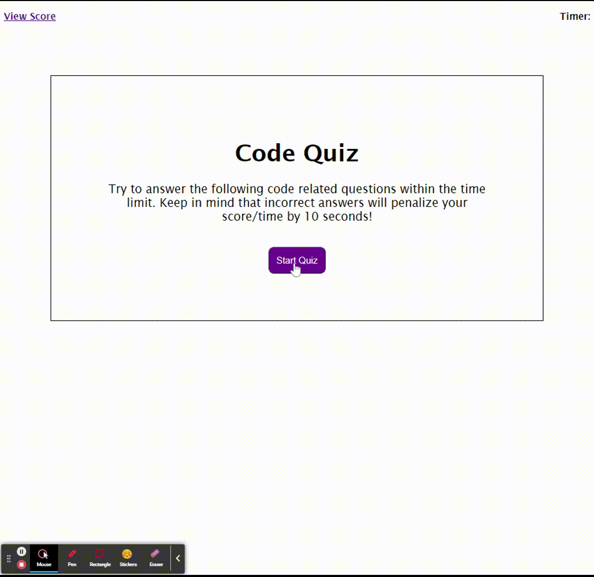

# Coding_Quiz

As a student, I want to practice coding and the best way to do that is through a quiz. This request has been delivered has been delivered. 

## What is this webpage for?

Like it's name, this website is powered by Java to help protect your companies sensitive information by providing you with secure passwords that will be the first defense in life against a cyber attack. 

## How to operate/ navigate this page?

The webpage is used in your browser. By clicking the start Button, you are then prompted to answer a number of questions. Afterwards, you are then asked to input your initials and it will be saved. Then the application should navigate you to a view of all the scores. Here you have the option to wither go back or clear the data. 

## Demo

 

## Links
GitHub: https://github.com/ed2022/Code_Quiz.git
Webpage: https://ed2022.github.io/Code_Quiz/

Note that the HTML and CSS where already given. 

## "User Story"

Note that this following was what was specifically asked~ 

```
GIVEN I am taking a code quiz
WHEN I click the start button
THEN a timer starts and I am presented with a question
WHEN I answer a question
THEN I am presented with another question
WHEN I answer a question incorrectly
THEN time is subtracted from the clock
WHEN all questions are answered or the timer reaches 0
THEN the game is over
WHEN the game is over
THEN I can save my initials and my score

```